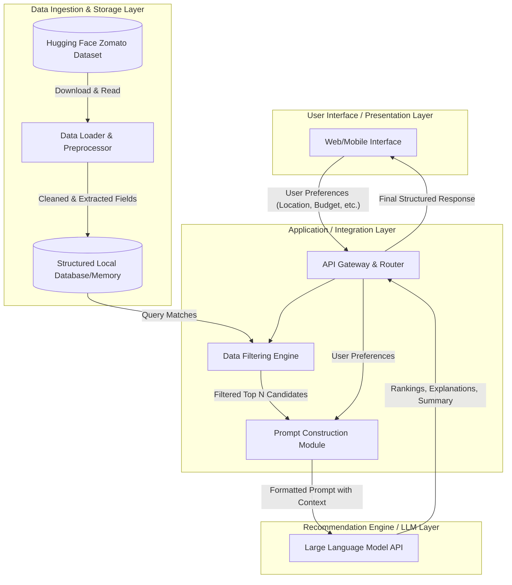

# System Architecture: AI-Powered Restaurant Recommendation System

This document outlines the detailed technical architecture for the AI-Powered Restaurant Recommendation System, inspired by Zomato. It is based on the requirements defined in the project context.

## 1. High-Level Architecture

The system follows a typical 3-tier architecture with an added LLM intelligence layer.

## 2. Component Breakdown

### 2.1 Data Ingestion & Storage Layer
* **Data Loader & Preprocessor:** A scheduled or one-time batch script that downloads the Zomato dataset from Hugging Face (`ManikaSaini/zomato-restaurant-recommendation`). It cleans the data (handling missing values, normalizing text) and extracts the required fields: `restaurant name`, `location`, `cuisine`, `cost`, `rating`.
* **Structured Local Database:** The cleaned dataset is stored locally. For a prototype, this can be in-memory (e.g., a Pandas DataFrame) or a lightweight database like SQLite.

### 2.2 Application / Integration Layer
* **API Gateway & Router:** Exposes RESTful endpoints (e.g., `/recommend`) that accept user input preferences (`Location`, `Budget`, `Cuisine`, `Minimum Rating`, `Additional Preferences`).
* **Data Filtering Engine:** A critical middle-layer component. Passing the entire dataset to an LLM is expensive and exceeds context limits. This engine performs a pre-filtering step (using SQL or DataFrame operations) based on hard constraints (e.g., filtering out restaurants outside the chosen city, below the minimum rating, or outside the budget) to narrow the list down to a subset of candidates (e.g., top 10-20 matches).
* **Prompt Construction Module:** Takes the user's natural language preferences and the structured data of the filtered candidate restaurants, merging them into a well-designed prompt template. 

### 2.3 Recommendation Engine (LLM Layer)
* **Large Language Model (LLM):** Acts as the reasoning engine. It ingests the prompt, evaluates the candidate restaurants against the user's specific (and sometimes nuanced) preferences, and outputs:
  * A ranked list of the best choices.
  * A personalized explanation of *why* each restaurant fits the user's criteria.
  * An optional summary of the overall recommendations.

### 2.4 User Interface / Presentation Layer
* **Web/Mobile Application:** A user-friendly interface that captures user inputs via forms or natural language search bars and presents the final LLM-generated recommendations in an easily readable format (cards showing Restaurant Name, Cuisine, Rating, Estimated Cost, and the AI-generated explanation).

## 3. Data Flow

1. **Initialization:** The Data Loader pulls the dataset from Hugging Face, cleans it, and loads it into the local database.
2. **User Request:** The user submits their preferences via the UI.
3. **Filtering:** The API receives the request and asks the Filtering Engine to query the local database for restaurants matching the hard constraints.
4. **Prompting:** The filtered list and the user's preferences are sent to the Prompt Construction Module, which generates a specific instruction string for the LLM.
5. **Reasoning:** The LLM receives the prompt, ranks the choices, and generates human-like explanations.
6. **Display:** The API receives the LLM's response, parses it, and sends the structured data back to the UI to be rendered for the user.

## 4. Suggested Technology Stack
* **Frontend:** React.js / Next.js / Streamlit (for rapid prototyping)
* **Backend:** Python (FastAPI or Flask)
* **Data Processing:** Pandas
* **LLM Integration:** LangChain / Groq API
* **Database:** SQLite or directly in-memory using Pandas (for Milestone 1)
